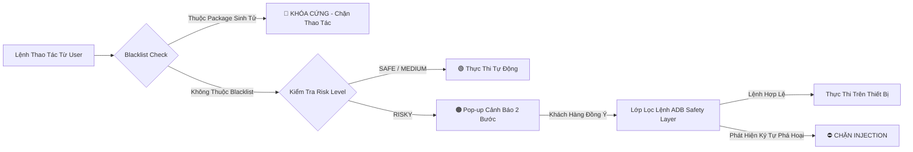
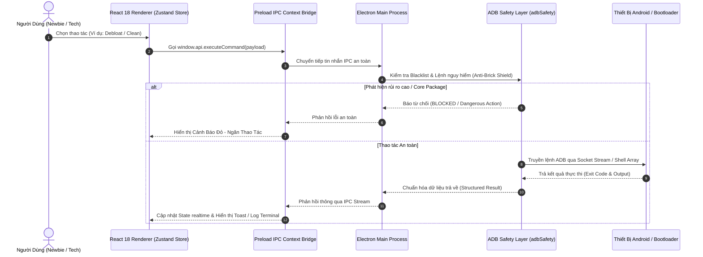

<div align="center">

# 💎 KT ADB TOOL PRO
### *The Next-Generation Enterprise Android Management & Optimization Suite*

[](https://github.com/khoaiprovip123/KT_ADB_Tool/releases)
[](https://github.com/khoaiprovip123/KT_ADB_Tool/actions)
[](https://www.electronjs.org/)
[](https://react.dev/)
[](https://www.typescriptlang.org/)
[](https://github.com/khoaiprovip123/KT_ADB_Tool)
[](LICENSE)

<p align="center">
  <b>KT ADB Tool Pro</b> là công cụ điều khiển, tối ưu hóa và quản trị thiết bị Android cao cấp qua giao thức ADB & Fastboot.<br/>
  Giao diện <b>Glassmorphism UI (Kính Mờ Modern)</b> sang trọng, tích hợp <b>Lá Chắn Bảo Vệ Chống Brick Thiết Bị</b> độc quyền cho người dùng và kỹ thuật viên.
</p>

---

[Thông Điệp Tác Giả](#-thông-điệp-tác-giả--sứ-mệnh-sản-phẩm) • 
[Safety Shield](#-lá-chắn-bảo-vệ-chống-brick--an-toàn-người-dùng) • 
[Tính Năng](#-tính-năng-nổi-bật) • 
[Luồng Kỹ Thuật](#-kiến-trúc-hệ-thống--luồng-dữ-liệu-code) • 
[Cài Đặt & Dev](#-hướng-dẫn-cài-đặt--phát-triển) • 
[Bảo Mật](#-quy-chuẩn-bảo-mật)

---

</div>

<br/>

## 💌 Thông Điệp Tác Giả & Sứ Mệnh Sản Phẩm

> *"KT ADB Tool Pro được ra đời từ mong muốn mang lại một giải pháp quản trị Android mạnh mẽ, trực quan và an toàn nhất cho cộng đồng kỹ thuật viên cũng như người dùng yêu thích công nghệ tại Việt Nam. Sản phẩm không chỉ đơn thuần là bộ công cụ ADB, mà là lời cam kết về tính an toàn dữ liệu, sự mượt mà trong trải nghiệm và tinh thần chia sẻ mã nguồn mở."*
> 
> **— Tác giả khoaiprovip123**

<br/>

---

## 🛡️ Lá Chắn Bảo Vệ Chống Brick & An Toàn Người Dùng (Brick-Proof Safety Shield)

Đối với người dùng mới hoặc kỹ thuật viên thao tác nhanh, nguy cơ vô tình xóa nhầm ứng dụng hệ thống làm điện thoại bị **Bootloop (treo logo)** hoặc **Brick** là rủi ro lớn nhất. **KT ADB Tool Pro** xây dựng cơ chế bảo vệ 4 lớp chủ động:



### 1. 🛑 Danh Sách Đen Bảo Vệ Package Sinh Tử (Core System Blacklist)
Công cụ tự động duy trì danh sách bảo vệ các gói dịch vụ sinh tử của Android & OEM (Xiaomi MIUI/HyperOS, Samsung OneUI, OPPO, Vivo...):
> `android`, `com.android.systemui`, `com.android.settings`, `com.android.phone`, `com.android.providers.telephony`, `com.android.vending`, `com.miui.securitycenter`, `com.miui.home`, `com.sec.android.app.launcher`...

### 2. 🚦 Phân Cấp Rủi Ro 4 Mức Độ (Visual Risk Level Rating)

| Mức Độ Rủi Ro | Nhãn Hiển Thị | Cơ Chế Bảo Vệ |
| :--- | :---: | :--- |
| **SAFE** | 🟢 **AN TOÀN** | Đã kiểm chứng 100%. Gỡ bỏ hoặc áp dụng không gây ảnh hưởng đến hệ thống. |
| **MEDIUM** | 🟡 **CÂN NHẮC** | Các ứng dụng tiện ích hoặc cài đặt hệ thống nhẹ. Tùy chỉnh theo nhu cầu. |
| **RISKY** | 🟠 **RỦI RO** | Can thiệp sâu. Bắt buộc hiển thị Pop-up xác nhận 2 bước trước khi thực thi. |
| **KEEP / DANGEROUS** | 🔴 **CẤM XÓA** | Ứng dụng cốt lõi hệ thống. **Khóa Cứng** hoàn toàn để ngăn ngừa treo máy. |

### 3. 🛡️ Bộ Lọc Chống Lệnh Nguy Hiểm & Injection (`adbSafety.ts`)
* **Chặn lệnh phá hoại**: Phân tích và chặn đứng các lệnh xóa partition hoặc brick bộ nhớ flash (`rm -rf /`, `dd if=/dev/zero`, `fastboot erase`...).
* **Khử trùng lặp & Anti-Injection**: Loại bỏ các ký tự nối lệnh dangerous (`|`, `&`, `;`, `$`, `` ` ``), đảm bảo lệnh ADB luôn thực thi dạng mảng đối số an toàn.

### 4. 🔄 Phục Hồi Khẩn Cấp 1-Click (1-Click Emergency Rollback)
* Mọi ứng dụng bị gỡ hoặc vô hiệu hóa đều có thể phục hồi trạng thái ban đầu chỉ với 1 click **Khôi phục (Restore)**.

<br/>

---

## 🌟 Tính Năng Nổi Bật

### 1. ⚡ Nhận Diện Thiết Bị & ROM Port Chính Xác (Smart Codename Resolver)
Áp dụng thuật toán truy vấn đa tầng ưu tiên `ro.boot.device` -> `ro.product.mod_device` -> `ro.vendor.product.device`... đảm bảo nhận diện đúng tên mã gốc phần cứng, loại bỏ hiện tượng sai tên mã do ROM Port.

### 2. 🗑️ Quản Lý Ứng Dụng & Debloat Pro (App Manager)
* Phân loại trực quan: App Người Dùng, App Hệ Thống, App Đã Vô Hiệu Hóa.
* Bộ lọc Presets 80+ Bloatware phổ biến (Xiaomi, Samsung, Google Android).
* Thao tác an toàn: Uninstall User 0, Disable, Restore, Kéo thả cài đặt APK.

### 3. 🚀 Dọn Dẹp Nhanh & Giải Phóng RAM Chuyên Sâu (Quick Cleaner Pro)
* Dọn dẹp Logcat, Cache ứng dụng ngầm, Tệp tin tạm.
* Chuỗi 3-Layer App Killer ngắt sạch ứng dụng chạy ngầm rác.
* Nén bộ nhớ runtime ART (`am compact full`) giải phóng RAM tức thì.
* Dọn rác bộ nhớ tạm Social Media (Telegram, Zalo, Messenger, TikTok, Facebook).

### 4. 🎛️ Trung Tâm Tinh Chỉnh Trải Nghiệm (Experience Center)
* HyperOS 2 & 3 Advanced Visuals (Bật hiệu ứng mờ Blur & icon động).
* Thay đổi Tần số quét động (60Hz - 144Hz), DPI (`wm density`), Độ phân giải (`wm size`).
* Sửa trễ thông báo đa tầng cho app nhắn tin & Google Services.
* Cấu hình mã hóa Private DNS (AdGuard, Cloudflare, NextDNS).

### 5. 📺 Phản Chiếu Màn Hình Dài Tập (Scrcpy Mirroring)
* Tích hợp Scrcpy v64-bit trực tiếp, phản chiếu độ phân giải gốc 60fps+, độ trễ <15ms, hỗ trợ chuột và bàn phím PC.

### 6. 📁 Quản Lý File Kéo Thả (Modern File Explorer)
* Duyệt cây thư mục `/sdcard/`, Tải lên/Tải xuống tệp kéo thả mượt mà, xem trước thumbnail ảnh.

### 7. 📖 Thư Viện Lệnh ADB Chuyên Sâu (Advanced Catalog)
* Danh mục 100+ lệnh ADB chuyên sâu phân loại OEM (Xiaomi, Samsung, OPPO, Vivo, Pixel...).

### 8. 🎮 Tối Ưu Chơi Game & Mở Khóa Hiệu Năng (Game Boost)
* Vô hiệu hóa Joyose (Xiaomi) / GOS (Samsung) chống bóp xung nhiệt độ, chuyển CPU Governor sang `performance`.

### 9. 🔋 Quản Lý Sức Khỏe Pin (Battery Health)
* Tra cứu 140+ profile pin thiết kế (mAh), kiểm tra Cycle Count & phần trăm độ chai pin, bật Battery Protection Mode.

### 10. 🔌 Kết Nối Không Dây & Đa Thiết Bị (Wireless Debugging)
* Chuyển đổi TCP/IP 1-click, ghép nối Wireless Debugging Android 11+ với 6-digit Pairing Code, chuyển đổi giữa nhiều thiết bị cắm đồng thời.

<br/>

---

## 🏗️ Kiến Trúc Hệ Thống & Luồng Dữ Liệu Code

Dưới đây là sơ đồ luồng dữ liệu tương tác giữa các tầng kiến trúc trong hệ thống:



<br/>

---

## 💻 Hướng Dẫn Cài Đặt & Phát Triển

### Yêu Cầu Môi Trường
* **Node.js**: `v20.x` hoặc `v22.x LTS`
* **NPM**: `v10.x` trở lên
* **Hệ điều hành**: Windows 10 / 11 (64-bit)

### Các Bước Cài Đặt & Khởi Chạy Mã Nguồn

```bash
# 1. Clone mã nguồn dự án
git clone https://github.com/khoaiprovip123/KT_ADB_Tool.git
cd KT_ADB_Tool

# 2. Cài đặt các gói phụ thuộc (Dependencies)
npm install

# 3. Khởi chạy ứng dụng chế độ Chỉnh sửa Trực tiếp (Dev Mode)
npm run dev

# 4. Kiểm tra lỗi Kiểu Dữ Liệu TypeScript (Strict Typecheck)
npm run typecheck

# 5. Chạy toàn bộ hệ thống Unit Tests tự động (Vitest Suite)
npm test

# 6. Đóng gói Bộ Cài Đặt Phân Phối Windows (.exe Setup Installer)
npm run build:win
```

<br/>

---

## 🛡️ Quy Chuẩn Bảo Mật

* **Command Injection Shield**: Mọi tham số từ Renderer được làm sạch, loại bỏ các ký tự shell nguy hiểm. Lệnh ADB chạy dưới dạng mảng đối số độc lập (`execFile` / `spawn`).
* **Content Security Policy (CSP)**: Thẻ CSP nghiêm ngặt trong `index.html`, giới hạn nguồn script và kết nối IPC.
* **Xác Thực Cập Nhật Bằng SHA-256 Checksum**: Trình tự động cập nhật kiểm tra checksum trước khi thực thi nâng cấp.

<br/>

---

<div align="center">

### 🤝 Đóng Góp & Đồng Hành

Dự án phát triển với tinh thần mã nguồn mở chuẩn mực.<br/>
Mọi ý kiến đóng góp, báo lỗi tính năng hoặc đóng góp mã nguồn (Pull Request) đều được trân trọng!

**Developed with ❤️ by [khoaiprovip123](https://github.com/khoaiprovip123)**

</div>
