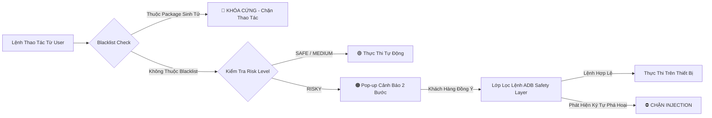
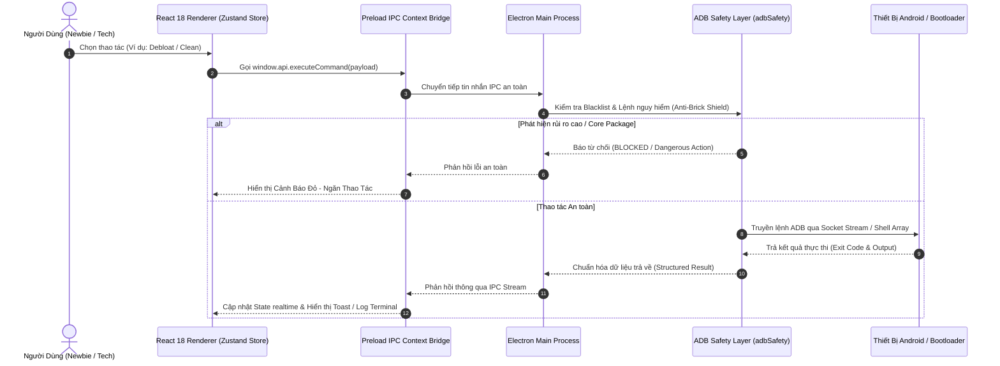

<div align="center">

# 💎 KT ADB TOOL PRO v2.5.3
### *The Next-Generation Enterprise Android Management & Optimization Suite*

[](https://github.com/khoaiprovip123/KT_ADB_Tool/releases)
[](https://github.com/khoaiprovip123/KT_ADB_Tool/actions)
[](https://www.electronjs.org/)
[](https://react.dev/)
[](https://www.typescriptlang.org/)
[](https://github.com/khoaiprovip123/KT_ADB_Tool)
[](LICENSE)

<p align="center">
  <b>KT ADB Tool Pro</b> là công cụ điều khiển, tối ưu hóa và quản trị thiết bị Android cao cấp qua giao thức ADB & Fastboot.<br/>
  Thiết kế theo chuẩn <b>Glassmorphism UI (Kính Mờ Hiện Đại)</b>, tích hợp <b>Lá Chắn Bảo Vệ Chống Brick Thiết Bị</b> cho người dùng mới.
</p>

---

[Safety Shield](#-lá-chắn-bảo-vệ-chống-brick--an-toàn-người-dùng-mới) • 
[Key Features](#-tính-năng-thượng-hạng) • 
[Architecture](#-kiến-trúc-hệ-thống--luồng-dữ-liệu) • 
[Developer Guide](#-hướng-dẫn-phát-triển--build) • 
[Security Standard](#-bảo-mật--quy-chuẩn-ipc)

---

</div>

<br/>

> [!NOTE]  
> **Phiên bản v2.5.3 (Cập nhật 05/08/2026)**: Tích hợp **Lá Chắn Bảo Vệ Chống Brick Máy (Brick-Proof Safety Shield)**, giải quyết dứt điểm lỗi nhận diện sai tên mã (Codename) trên các bản **ROM Port**, tối ưu thuật toán nén RAM runtime ART (`am compact full`) và nâng cấp bộ lọc 80+ Debloat Presets Tiếng Việt.

<br/>

---

## 🛡️ Lá Chắn Bảo Vệ Chống Brick & An Toàn Người Dùng Mới (Brick-Proof Safety Shield)

Đối với người dùng mới hoặc kỹ thuật viên thao tác nhanh, nguy cơ vô tình xóa nhầm ứng dụng cốt lõi làm điện thoại bị **Bootloop (treo logo)** hoặc **Biến thành cục gạch (Brick)** là rủi ro lớn nhất. **KT ADB Tool Pro** xây dựng cơ chế bảo mật 4 lớp chủ động:



### 1. 🛑 Danh Sách Đen Bảo Vệ Package Sinh Tử (Core System Package Blacklist)
Công cụ tự động duy trì danh sách bảo vệ các gói dịch vụ sinh tử của Android & OEM (Xiaomi MIUI/HyperOS, Samsung OneUI, OPPO, Vivo...):

> `android`, `com.android.systemui`, `com.android.settings`, `com.android.phone`, `com.android.providers.telephony`, `com.android.vending`, `com.miui.securitycenter`, `com.miui.home`, `com.sec.android.app.launcher`...

* **Cơ chế khóa cứng**: Khi người dùng chọn các ứng dụng này, hệ thống sẽ tự động vô hiệu hóa nút xóa/tắt và hiển thị cảnh báo đỏ **Nghiêm Cấm Thao Tác**.

### 2. 🚦 Phân Cấp Rủi Ro 4 Mức Độ (Visual Risk Level Rating)
Mọi ứng dụng, lệnh ADB và tinh chỉnh hệ thống đều được dán nhãn mức độ an toàn rõ ràng:

| Mức Độ Rủi Ro | Nhãn Hiển Thị | Mô Tả & Cơ Chế Bảo Vệ |
| :--- | :---: | :--- |
| **SAFE** | 🟢 **AN TOÀN** | Đã kiểm chứng 100% bởi cộng đồng. Gỡ bỏ hoặc áp dụng không gây ảnh hưởng đến hệ thống. |
| **MEDIUM** | 🟡 **CÂN NHẮC** | Các ứng dụng tiện ích ít dùng hoặc cài đặt hệ thống nhẹ. Cho phép tùy chỉnh theo nhu cầu. |
| **RISKY** | 🟠 **RỦI RO** | Các tính năng can thiệp sâu. Bắt buộc hiển thị Pop-up xác nhận 2 bước trước khi thực thi. |
| **KEEP / DANGEROUS** | 🔴 **CẤM XÓA** | Ứng dụng cốt lõi hệ thống. Hệ thống **Khóa Cứng** hoàn toàn để ngăn ngừa treo máy (Bootloop). |

### 3. 🛡️ Bộ Lọc Chống Lệnh ADB Nguy Hiểm & Injection (`adbSafety.ts`)
* **Chặn câu lệnh phá hoại**: Tự động phân tích và chặn đứng các câu lệnh nguy hiểm có khả năng xóa partition hệ thống hoặc brick bộ nhớ flash (ví dụ: `rm -rf /`, `dd if=/dev/zero`, `flashall`, `fastboot erase`, `fastboot format`).
* **Khử trùng lặp & Chống Injection**: Loại bỏ hoàn toàn các ký tự nối lệnh nguy hiểm (`|`, `&`, `;`, `$`, `` ` ``), đảm bảo lệnh ADB luôn được thực thi dưới dạng mảng tham số an toàn.

### 4. 🔄 Phục Hồi Khẩn Cấp 1-Click (1-Click Rollback / Emergency Restore)
* **Khôi phục nguyên trạng**: Mọi ứng dụng bị gỡ khỏi `user 0` hoặc bị vô hiệu hóa đều có thể phục hồi lại trạng thái ban đầu chỉ với 1 cú nhấp vào nút **Khôi phục (Restore)** mà không cần nhớ tên package hay gõ lệnh phức tạp.

<br/>

---

## 🌟 Tính Năng Thượng Hạng

### 1. ⚡ Nhận Diện Thiết Bị & ROM Port Chính Xác Tuyệt Đối (Smart Codename Resolver)
Thay vì chỉ đọc property mặc định dễ bị các bản ROM Port làm sai lệch thông tin, **KT ADB Tool Pro** áp dụng thuật toán truy vấn đa tầng thông minh:

| Chỉ Số Tra Cứu | Thứ Tự Ưu Tiên | Mục Đích & Giải Pháp |
| :--- | :---: | :--- |
| `ro.boot.device` | **1 (Cao nhất)** | Lấy tên mã phần cứng thực tế được Bootloader nạp (Không thể bị spoofing bởi ROM Port). |
| `ro.product.mod_device` | **2** | Tên mã thiết bị tinh chỉnh từ nhà sản xuất Xiaomi/Poco/Redmi. |
| `ro.vendor.product.device` | **3** | Tên mã đăng ký trong Vendor Partition. |
| `ro.product.vendor.device` | **4** | Tên mã nhà cung cấp linh kiện. |
| `ro.build.product` | **5** | Tên mã nhận diện build hệ thống. |
| `ro.product.device` | **6** | Tên mã sản phẩm mặc định. |

> [!TIP]
> **Đã loại bỏ hoàn toàn `ro.product.board`**: Loại trừ hiện tượng 100% máy dùng chip Qualcomm SM7325 (như Xiaomi 11 Lite 5G NE `lisa`) bị nhận nhầm thành tên mainboard `missi`. Tự động cắt bỏ các suffix mã vùng (`_global`, `_eea`, `_in`, `_ru`, `_id`, `_tr`, `_tw`, `_jp`) để trả về codename gốc duy nhất.

<br/>

### 2. 🗑️ Quản Lý Ứng Dụng & Siêu Bộ Lọc Debloat (App Manager Pro)
* **Phân loại trạng thái tức thì**: Lọc trực quan giữa **App Người Dùng (User)**, **App Hệ Thống (System)** và **App Đã Vô Hiệu Hóa (Disabled)**.
* **Bộ lọc Presets 80+ Bloatware phổ biến (Gỡ 1-Click)**:
  * **Xiaomi / Poco / Redmi**: *GetApps (Cửa hàng rác), Joyose (Bóp hiệu năng), Mi Pay (Thanh toán), Bàn phím Sogou/Baidu/iFlyTek, MIUI Analytics (Theo dõi ngầm), MSA (Quảng cáo hệ thống), App Vault, Mi Video, Mi Music, Mi Browser, Yellow Pages...*
  * **Samsung OneUI**: *Bixby Agent, Samsung Daily/Free, Edge People Stripe, Game Home/Tools, AR Emoji, Samsung Browser...*
  * **Google Android**: *Google TV/Videos, YouTube Music, Google Docs/Photos, TalkBack, Wellbeing, Duo/Tachyon...*
* **Thao tác an toàn 3 cấp độ**:
  * `Uninstall User 0` (`pm uninstall -k --user 0`): Gỡ bỏ ứng dụng khỏi không gian người dùng.
  * `Disable` (`pm disable-user --user 0`): Vô hiệu hóa ứng dụng ngầm không gây rủi ro treo boot.
  * `Restore` (`pm enable`): Phục hồi ứng dụng đã xóa hoặc bị vô hiệu hóa chỉ với 1 cú nhấp.
  * `Install APK`: Cài đặt tệp tin APK bằng cơ chế kéo thả đệm đa luồng.

<br/>

### 3. 🚀 Dọn Dẹp Nhanh & Giải Phóng RAM Chuyên Sâu (Quick Cleaner Pro)
* **Quy trình Dọn Dẹp 1-Click (Automated 1-Click Clean)**:
  1. `Clear Logcat`: Xóa sạch bộ nhớ đệm nhật ký hệ thống ADB.
  2. `Clear Temp Files`: Dọn dẹp thư mục tạm `/sdcard/Android/data/*/cache` và `/data/local/tmp/`.
  3. `3-Layer App Killer`: Triệt hạ ứng dụng ngầm bằng chuỗi 3 lệnh `am force-stop --user 0`, `am kill --user 0` và `pkill -9 -f`.
  4. `ART Memory Compact`: Nén cấu trúc bộ nhớ runtime ART `am compact full` giải phóng hàng trăm MB RAM tức thì trên Android 10+.
* **Dọn Dẹp Rác Mạng Xã Hội (Social Media Cleaner)**: Tự động quét và xóa sạch cache hình ảnh, video, sticker tạm của Telegram, Nekogram, Zalo, Messenger, TikTok, Facebook, Instagram.
* **Danh Sách Trắng Thông Minh (Smart Whitelist)**: Cho phép bảo vệ tối đa 500 ứng dụng quan trọng (Zalo, Banking, Messenger...) không bị đóng ngầm trong quá trình dọn dẹp.

<br/>

### 4. 🎛️ Trung Tâm Tinh Chỉnh Trải Nghiệm (Experience Center)
* **HyperOS 2 & 3 Advanced Visuals**:
  * Kích hoạt hiệu ứng làm mờ (Blur), biểu tượng động và giao diện cao cấp trên **HyperOS 2** (`IMQSNative release 3`) & **HyperOS 3** (`IMQSNative release 4`).
* **Cấu Hình Màn Hình & Tần Số Quét Động**:
  * Tự động nhận diện và thay đổi tần số quét đệm: **60Hz | 90Hz | 120Hz | 144Hz**.
  * Chỉnh sửa mật độ điểm ảnh **DPI** (`wm density`) và độ phân giải màn hình (`wm size`) tùy chỉnh.
* **Tối Ưu Thông Báo (Fix Trễ Thông Báo)**:
  * Đưa Google Play Services (GMS/GSF) và app nhắn tin vào **Doze Whitelist** (`dumpsys deviceidle whitelist +pkg`).
  * Mở toàn bộ quyền AppOps `WAKE_LOCK` & `RUN_ANY_IN_BACKGROUND` giúp ứng dụng nổ thông báo tức thì.
* **Cấu Hình Private DNS Mã Hóa & Chặn Quảng Cáo**:
  * Tích hợp cấu hình nhanh **AdGuard DNS** (`dns.adguard.com`), **Cloudflare 1.1.1.1** (`1dot1dot1dot1.cloudflare-dns.com`), **NextDNS**, **Google DNS**.

<br/>

### 5. 📺 Phản Chiếu Màn Hình Dài Tập (Scrcpy Ultra Mirroring)
* Tích hợp sẵn bộ công cụ **Scrcpy v64-bit** trực tiếp trong bộ cài.
* Khởi chạy trình chiếu màn hình độ phân giải gốc, tốc độ khung hình 60fps+, độ trễ cực thấp (<15ms), hỗ trợ điều khiển cảm ứng bằng chuột và gõ phím từ PC.

<br/>

### 6. 📁 Quản Lý File Kéo Thả (Modern File Explorer)
* Duyệt trực quan toàn bộ cây thư mục `/sdcard/`.
* Tải xuống (Pull) và Tải lên (Push) tệp tin với giao diện kéo thả cực mượt.
* Xem trước thumbnail ảnh trực tiếp, tạo thư mục, đổi tên và xóa tệp tin an toàn.

<br/>

### 7. 📖 Thư Viện Lệnh ADB Chuyên Sâu 100+ Lệnh (Advanced Catalog)
* Danh mục lệnh ADB chuyên sâu phân loại theo từng OEM: **Xiaomi, Samsung, OPPO/Realme, Vivo, Google Pixel...**
* Hỗ trợ đầy đủ 3 chế độ tương tác: **Read (Đọc trạng thái)**, **Apply (Áp dụng)**, **Rollback (Hoàn tác)**.

<br/>

### 8. 🎮 Tối Ưu Chơi Game & Mở Khóa Hiệu Năng GPU (Game Boost & Throttle Bypass)
* **Tắt Bóp Xung Nhiệt Độ (OEM Throttle Bypass)**: Hỗ trợ vô hiệu hóa dịch vụ Joyose (Xiaomi) và Game Optimization Service / GOS (Samsung) giúp FPS ổn định khi máy nóng.
* **CPU Governor Mode**: Chuyển chế độ điều phối CPU sang `performance` giúp tối đa tốc độ xử lý khi chơi game nặng.

<br/>

### 9. 🔋 Tra Cứu Pin & Quản Lý Sức Khỏe Pin (Battery Health & Charge Shield)
* Tra cứu cơ sở dữ liệu **140+ profile pin** thiết kế (mAh) chính xác theo tên mã máy.
* Kiểm tra số lần sạc (Cycle Count) và phần trăm độ chai pin thực tế từ `dumpsys battery`.
* Hỗ trợ bật Chế độ sạc bảo vệ pin (Battery Protection Mode 80% / 85%).

<br/>

### 10. 🔌 Kết Nối Không Dây & Quản Lý Đa Thiết Bị (Wireless Debugging & Multi-Device Manager)
* **Wi-Fi TCP/IP 1-Click Switch**: Chuyển đổi nhanh cổng `adb tcpip 5555` không cần gõ CMD.
* **Wireless Debugging (Android 11+)**: Ghép nối không dây thế hệ mới với giao thức 6-digit Pairing Code và Pairing Port linh hoạt.
* **Multi-Device Switcher**: Cho phép kết nối và chuyển đổi nhanh giữa nhiều thiết bị cắm đồng thời vào PC.

<br/>

### 11. 🛠️ Bộ Công Cụ Chẩn Đoán Kỹ Thuật Viên (Technician Repair Suite)
* Khởi động lại 1-Click sang các chế độ: **Reboot Normal**, **Reboot Recovery**, **Reboot Bootloader (Fastboot)**, **Reboot EDL (Emergency Download Mode)**.
* Chụp ảnh màn hình (Screenshot) & Quay video màn hình (Screen Record) trực tiếp lưu vào PC.
* Xuất file nhật ký sự cố `adb bugreport` và `logcat` cho lập trình viên phân tích ROM.

<br/>

### 12. 🔒 Quản Lý Quyền Chạy Ngầm & AppOps Chuyên Sâu (AppOps Deep Permission Tuning)
* Kiểm soát các quyền chạy ngầm hệ thống qua Android AppOps Engine: `WAKE_LOCK`, `RUN_IN_BACKGROUND`, `SYSTEM_ALERT_WINDOW` (Xuất hiện trên cùng), `WRITE_SETTINGS` (Thay đổi cài đặt hệ thống).
* Chống hệ thống tự động đưa ứng dụng vào trạng thái đóng băng (App Hibernation Bypass).

<br/>

### 13. 🎨 Mod Trải Nghiệm MIUI / HyperOS Độc Quyền (Xiaomi Custom Mod Registry)
* **Kích hoạt Giao diện Cấp cao**: Thêm cài đặt `deviceLevelList "v:1,c:3,g:3"` kích hoạt animation biểu tượng và mờ thư mục trên các dòng Redmi / POCO giá rẻ.
* **Tắt Đếm Nhược Cảnh Báo 10 Giây**: Bỏ qua đếm ngược 10 giây cài đặt bảo mật ADB trên MIUI/HyperOS.
* **Bật Siêu Tiết Kiệm Pin**: Kích hoạt giao diện Ultra Battery Saver Mode nâng cao.

<br/>

### 14. 📊 Terminal Theo Dõi Lệnh ADB Realtime (Live Output Terminal Stream)
* Tự động stream toàn bộ output lệnh ADB từ Main Process xuống giao diện Terminal retro mã hóa màu trực quan (**Xanh = Thành công**, **Đỏ = Thất bại**, **Cyan = ADB Stream**).
* Hiển thị phần trăm tiến trình (Progress Modal %) khi chạy thao tác hàng loạt (Batch Debloat, Fix Notifications, Fast App Killer).

<br/>

### 15. ⚡ Bộ Đệm Dữ Liệu Tốc Độ Cao (High-Speed Offline Caching)
* Lưu trữ bộ đệm danh sách package và thông tin phần cứng tại `localStorage`, giúp ứng dụng khởi động mở lên tức thì mà không cần quét lại từ đầu.

<br/>

---

## 🏗️ Kiến Trúc Hệ Thống & Luồng Dữ Liệu



<br/>

---

## 💻 Hướng Dẫn Phát Triển & Build

### Yêu Cầu Môi Trường Kỹ Thuật
* **Node.js**: `v22.x LTS` trở lên
* **NPM**: `v10.x` trở lên
* **Hệ điều hành**: Windows 10 / 11 (64-bit)

### Bộ Lệnh Thao Tác (Developer CLI Matrix)

```bash
# 1. Clone mã nguồn dự án
git clone https://github.com/khoaiprovip123/KT_ADB_Tool.git
cd KT_ADB_Tool

# 2. Cài đặt các gói phụ thuộc (Dependencies)
npm install

# 3. Khởi chạy ứng dụng chế độ Chỉnh sửa Trực tiếp (Dev Mode)
npm run dev

# 4. Kiểm tra lỗi Kiểu Dữ Liệu TypeScript (Strict Typecheck)
npm run typecheck

# 5. Chạy toàn bộ hệ thống Unit Tests tự động (Vitest Suite)
npm test

# 6. Quét bảo mật mã nguồn (Security Audit Scan)
npm run security:scan

# 7. Đóng gói ứng dụng dạng Thư mục Unpacked (Kiểm thử nhanh)
npm run build:unpack

# 8. Đóng gói Bộ Cài Đặt Phân Phối Chuẩn Windows (.exe Setup Installer)
npm run build:win
```

<br/>

---

## 🛡️ Bảo Mật & Quy Chuẩn IPC

* **Bảo vệ Chống Command Injection (`adbSafety.ts`)**:
  * Toàn bộ tham số từ Renderer được làm sạch, loại bỏ tuyệt đối các ký tự điều hướng shell nguy hiểm (`|`, `&`, `;`, `$`, `` ` ``, `>`, `<`).
  * Sử dụng phương thức thực thi lệnh theo mảng đối số độc lập `execFile` / `spawn` thay vì gọi host shell trực tiếp.
* **Content Security Policy (CSP)**:
  * Cấu hình thẻ CSP nghiêm ngặt trong `index.html`, cấm các nguồn script không rõ nguồn gốc, chặn Inline Execution nguy hiểm và giới hạn kết nối IPC.
* **Xác Thực Bản Phát Hành Bằng Mã SHA-256**:
  * Trình updater tích hợp tự động so sánh mã băm **SHA-256 Checksum** của file `.exe` được tải về từ GitHub Release trước khi thực hiện nâng cấp hệ thống.

<br/>

---

## 📊 Kết Quả Kiểm Chứng Chất Lượng (Quality Benchmark)

| Tiêu Chí Kiểm Đánh | Trạng Thái | Minh Chứng & Chỉ Số |
| :--- | :---: | :--- |
| **TypeScript Strict Checking** | **PASSED** | `tsc --noEmit` đạt 0 lỗi trên cả Node và Web |
| **Unit Test Suite** | **PASSED** | 11/11 Test Files, 71/71 Unit Tests Đạt 100% |
| **Production Build** | **PASSED** | Bundled thành công qua `electron-vite` |
| **Electron Packaging** | **PASSED** | `electron-builder` tạo file Installer đầy đủ binary |
| **NPM Audit Security** | **PASSED** | 0 Vulnerabilities trên môi trường Production |

<br/>

---

<div align="center">

### 🤝 Đóng Góp & Phát Triển

Dự án được xây dựng với tinh thần mã nguồn mở chuẩn mực.<br/>
Mọi đóng góp (Pull Request, Báo lỗi Issue) đều được chào đón!

**Developed with ❤️ by [khoaiprovip123](https://github.com/khoaiprovip123)**

</div>
